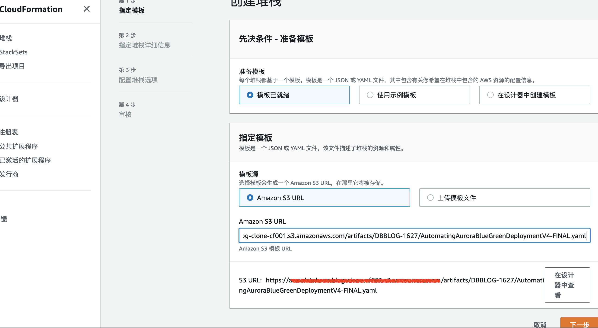
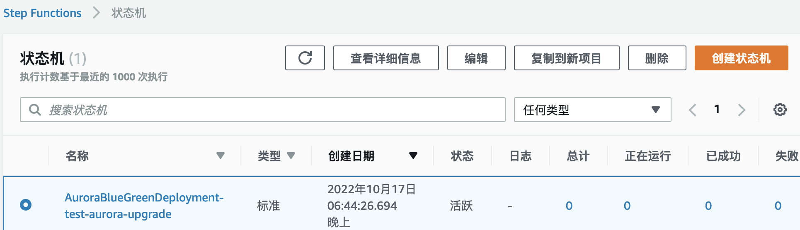

## Aurora1.0 升级到Aurora2.0 Cloudformation
[Automate the Amazon Aurora MySQL blue/green deployment process](https://aws.amazon.com/cn/blogs/database/automate-the-amazon-aurora-mysql-blue-green-deployment-process/) 文章介绍了方案细节，同时提供了Cloudformation 代码。本项目作了两个优化：
1. 源方案中使用了python`2.7`,会导致构建方案时失败。改为了`python3.7`
2. 源方案做的主要工作是clone集群和自动启动副本复制，因此目标集群的引擎版本是和源集群一样的。修改了创建实例的代码，把目标集群引擎强制为`Aurora2.0`.如下：
```
    #kwargs['Engine'] = clone_Cluster_Engine
    kwargs['Engine'] = 'aurora-mysql'
```

## 方案使用
### 下载方案代码
```
    git clone https://github.com/hillday/aws-aurora1-upgrade-cloudformation.git
```
### 上传方案到S3

在S3创建个存储桶，在存储桶下创建`artifacts/DBBLOG-1627`目录，然后把文件上传上去即可。**目录一定要正确**

### 部署方案
在cloudformation中创建堆栈即可，需要输入参数，具体参考blog。


### 启动方案
在`Step Function`中，启动方案即可。
